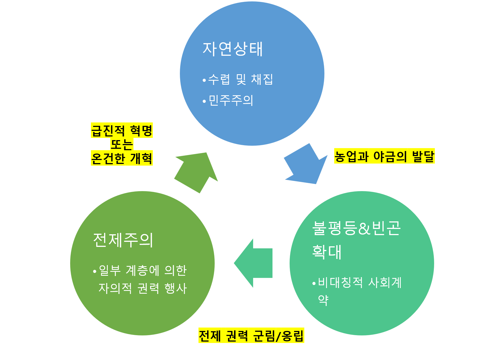
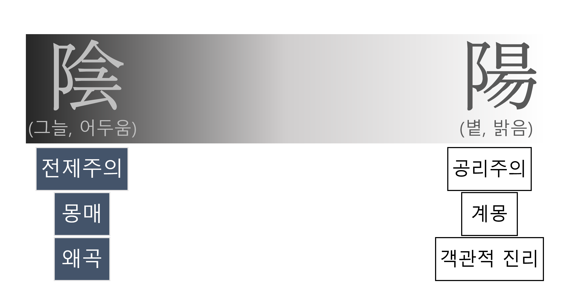
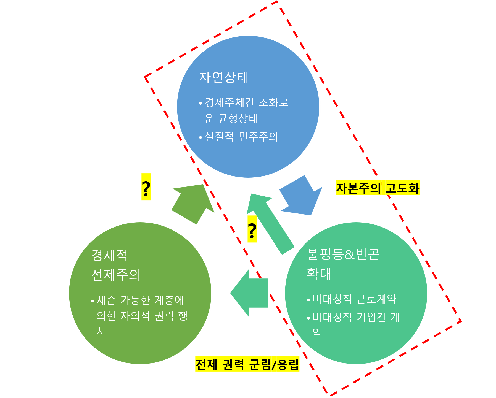
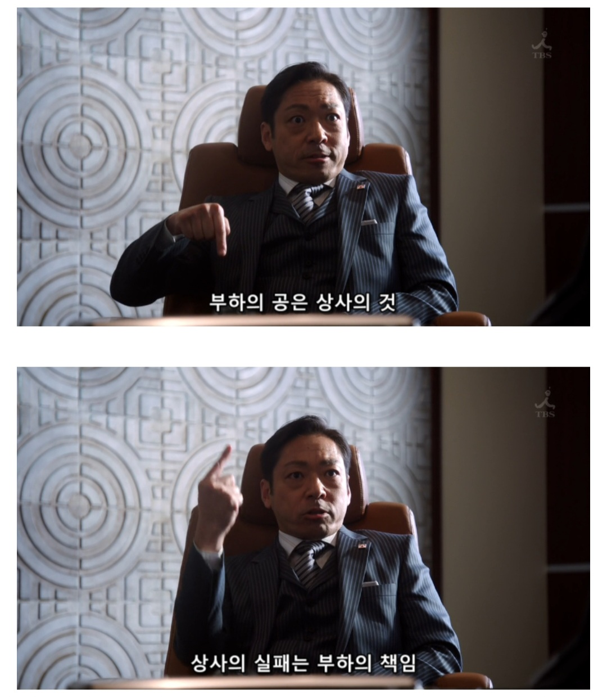

# **정치 경제 체제와 음양설 👉🏻 ⚖️💰&☯️**

## [암흑시대(Dark Ages)](https://ko.wikipedia.org/wiki/%EC%A4%91%EC%84%B8_%EC%95%94%ED%9D%91%EC%8B%9C%EB%8C%80)
> - ### 현대의 학계에서는 더 이상 공식적으로 사용하지 않는 용어 (참조: [위키피디아](https://en.wikipedia.org/wiki/Dark_Ages_(historiography)#Modern_scholarly_use))
> - ### 이탈리아 학자였던, [프란체스코 페트라르카](https://namu.wiki/w/%ED%94%84%EB%9E%80%EC%B2%B4%EC%8A%A4%EC%BD%94%20%ED%8E%98%ED%8A%B8%EB%9D%BC%EB%A5%B4%EC%B9%B4)가 처음 사용한, 서양의 '중세시대'를 가리켰던 표현
>> 👉🏻 페트라르카는 르네상스 시대를 열었던, 최후의 중세인인 동시에 최초의 르네상스인으로 평가됨 
> - ### - 왜 '**암흑**'이라는, 명암의 성질을 묘사할 때 사용하는 단어를 시대의 이름에 붙였었는가?
>> - ❗중세시대의 이전 및 이후 시대에서 발견되는 지식과 양해(knowledge and understanding, 빛/陽 에 비유)를 중세 전체에 걸쳐서 나타나는 무지와 오류(ignorance and error, 그늘/陰 에 비유)들과 명암에 비유하여 대비하였음 (출처: [위키피디아](https://ko.wikipedia.org/wiki/%EC%A4%91%EC%84%B8_%EC%95%94%ED%9D%91%EC%8B%9C%EB%8C%80), 참조: [Petrarch's Conception of the 'Dark Ages'](https://archive.org/details/in.ernet.dli.2015.110531/page/n115/mode/2up))
>> - [*chiron's idea*] 음양이라는 글자 자체가 우리말로는 "그늘과 볕"이다.  직관적으로 보더라도, 그늘 속에 묻혀있던 섭리는 그 모습을 백일하에 드러내기 위해서는 사람들이 이기적인 동기 등의 이유로 왜곡이나 날조하려고 하지 말고, 있는 그대로의 객관적인 진실 또는 진리를 규명하려는 태도를 가지고 탐구하려는 노력이 요구된다.

---

## [계몽시대(Age of Enlightenment)](https://ko.wikipedia.org/wiki/%EA%B3%84%EB%AA%BD%EC%8B%9C%EB%8C%80)의 [장 자크 루소(Jean-Jacques Rousseau)](https://ko.wikipedia.org/wiki/%EC%9E%A5%EC%9E%90%ED%81%AC_%EB%A3%A8%EC%86%8C)
> - ### [사회계약론](https://ko.wikipedia.org/wiki/%EC%82%AC%ED%9A%8C%EA%B3%84%EC%95%BD%EB%A1%A0): 전제주의가 상식으로 받아들여지던 시대에 국가 구성원 모두가 평등한 주권을 갖는, 민주주의 사회를 제안했다.
>> - 평생을 전제군주의 지배 아래 살아왔던 사람들에게는 그의 사상이 해괴망측하게 들렸을 것이다.  <에밀>과 <사회계약론>이 네덜란드에서 출판된 후에, 그의 인생 후반기에는 세상으로부터 박해를 받았다.
>>> `사회 계약은 개개인 상호간의 약속이며, 지배자에 대한 국민의 복종을 뜻하는 것이 아니다.`
>> - 일부 사람들에게는 친일파로 알려진, 구한말 서재필의 경우, 사회계약론을 조선에 소개하자 조선 백성들의 반감을 샀었다. [참조: [위키피디아](https://ko.wikipedia.org/wiki/%EC%84%9C%EC%9E%AC%ED%95%84#%EB%8F%85%EB%A6%BD%EC%8B%A0%EB%AC%B8_%EB%B0%9C%EA%B0%84)]
>>> `그는 사회계약론을 소개하며 조정이 인민의 재산과 행복을 지켜주는 조건부로 인민이 조정에 충성하는 것이라 하였다.  그러나 임금에 대한 맹목적인 충성을 당연시 여기던 당시의 백성들은 그가 소개한 사회계약론을 사회를 혼란으로 몰고 갈 괴상한 신사상 정도로 취급하였다.`
> - ### ⭐ [인간 불평등 기원론](https://ko.wikipedia.org/wiki/%EC%9D%B8%EA%B0%84_%EB%B6%88%ED%8F%89%EB%93%B1_%EA%B8%B0%EC%9B%90%EB%A1%A0): 🌾🪨⚒️[농업과 야금(冶金)기술의 발달](https://www.khanacademy.org/humanities/world-history/world-history-beginnings/birth-agriculture-neolithic-revolution/a/why-did-human-societies-get-more-complex)
>> 
> 1. ### **농업과 야금의 발달**
>> - 수렵과 채집보다 생존에 더 유리한 식량 공급 방법이었던, 농업의 증산을 위해 공동체를 형성하고 집단적으로 장시간 노동을 경작에 투입함 [참조: [칸 아카데미](https://www.khanacademy.org/humanities/world-history/world-history-beginnings/birth-agriculture-neolithic-revolution/a/why-did-human-societies-get-more-complex)]
> 2. ### **전제 권력 군림/옹립**
>> -  사극 <정도전>의 '하륜'의 캐릭터를 두고, "[인생은 하륜처럼](https://www.dogdrip.net/50588257)"이라는 유행어가 만들어짐.
>>> * ##### 만약에 극중 이방원 또는 하륜의 캐릭터가 추구했던 정치적 이념과 야망을 이상적으로 보는 구성원이 많아진다면, 그 사회는 자연상태의 회복이 가능한가?
> 3. ### **급진적 혁명 또는 온건한 개혁**
>> - 미국 초대 대통령 조지 워싱턴(George Washington)은 왜 왕위에 등극하는 일을 사양하였는가? [참조: [Quora](https://www.quora.com/Why-did-George-Washington-turn-down-an-offer-to-become-a-king)]
>>> * ##### 만약에 미국 혁명 전쟁기에 하륜과 같은 인물(들)이 독립전쟁에서 중추적인 역할을 수행하고 있었더라면, 워싱턴 대통령의 운명은 어땠을까?
>>> * ##### 미국 독립 전쟁 당시에는, "**나와 내 조상이 일군 나라인데 내 혈육이 아니면 누구에게 물려준단 말인가? 외국에게 넘긴단 말인가?**"라는 사회적 통념은 없었을까?
---

## **정치/경제 체제와 음양/명암의 이미지**
> 

> * 대체적으로, 사람에게는 그늘을 벗어나서 볕을 향해 나아가고자 하는 본능적 의지가 있다.
> * 전제 군주제나 봉건제 하에서도 아름다운 봄볕에 피어난 꽃처럼 화려한 삶을 살다가 간 사람들도 있었다.  
> 그런데도 중세를 '어둡다고' 볼 수 있는가?

---

## **사회 구조의 상태 기계(state machine) 점검**
> 

> * 헌정 아래의 전제권력 군림 및 옹립 방법론
>> * ##### 《[삼성을 생각한다](https://www.aladin.co.kr/shop/wproduct.aspx?ItemId=6290715)》 (김용철) - "족보에 삼성 사장 벼슬은 왜 못 남기나" 131p.
>>> ##### `내가 삼성에 들어간 게 잘못된 결정이라는 생각이 든 것은 입사 직후(1997년 8월)였다.  그래서 늘 어딘지 불편한 기분으로 지내곤 했다.  이런 내 모습을 삼성 수뇌부는 이해하지 못했다.  그들이 삼성 경영진이라는 직위에 대해 가진 자부심이 워낙 대단했기 때문이다. 실제로 삼성 주요 계열사 사장과 구조본 팀장들 중에는 자신들이 실제로 국가를 운영하고 있다고 믿는 이들이 많았다.  xxx가 특히 그랬다.  그는 "시시한 벼슬도 다 족보에 남기는데, '삼성 사장'이라는 벼슬은 왜 족보에 못 남기느냐"라는 말을 자주 했다.  그렇다면 사실상 국가를 운영한다는 생각을 갖고 있는 삼성 수뇌부는, 국가의 이익에 대해 얼마나 관심이 있었을까.  내가 보기엔 거의 관심이 없었다.  국가 운영자라는 자기규정과 국익에 대한 무관심이 양립한다는 게 이상한 일이지만, 사실 그랬다.  yyy, xxx 등은 오직 zzz의 사적 이익과 안전만이 관심사였다.  그들의 언어로 표현하면 "회장님과 그룹을 보위하는 일"이다.`

---

## **전제주의와 공리주의**
> * ### 공리주의 얘기 꺼내는 것은 공산주의 하자는 것일까?
>> * ##### [재일교포 개발자의 하소연](https://gall.dcinside.com/board/view/?id=programming&no=2246011&s_type=search_name&s_keyword=.ED.94.84.EB.A1.9C&page=1)
>>> * ##### 드라마 '[한자와 나오키](https://namu.wiki/w/%ED%95%9C%EC%9E%90%EC%99%80%20%EB%82%98%EC%98%A4%ED%82%A4)' 중에서

>>> 

> * ### 연좌 없이, 본인의 기여에 대한 보상이 최대한 그 기여 당사자에게 돌아가도록
>> * ##### 성과에 대한 무한한 보상을 허용해야 한다면, 다른 구성원들에 대해 세대를 초월하는 지배까지도 허용해야 하는가?  정말 보상에 제한을 두지 않는 것이 정상적인 자본주의적 이념인가?  만약에 그러한 보상에 최대치의 제한을 둔다면, 정말 아무도 그 최대치의 보상을 성취하기 위한 노력을 하지 않게 되는가?
>> * ##### 위험의 감수에 따르는 보상을 하는 것이 세상의 이치라면, 전제주의 왕조체제의 신하나 회사의 직원은 정말 군주나 사업가에 비해 안전한 신분인가?

> * ### 억울하면 출세를 하라
>> * ##### 임꺽정, 홍길동처럼...?

> * ### 자본주의는 도구일 뿐, 그 자체가 지향점이 될 수는 없어
>> * ##### [루스벨트의 뉴딜 정책이 없었다면 벌어졌을 세상에 대한 상상](https://gall.dcinside.com/board/view/?id=dcbest&no=76540&_dcbest=1&s_type=search_subject_memo&s_keyword=.EB.A3.A8.EC.A6.88.EB.B2.A8.ED.8A.B8&page=1)

> * ### 구글과 애드센스, 유튜브, 넷플릭스 등이 탄생하지 않았더라면 대한민국의 경제는?